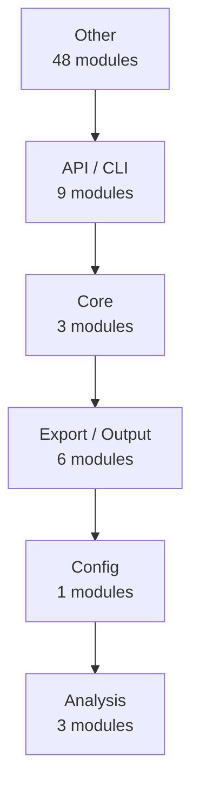

# fraq — Architecture

> 70 modules | 371 functions | 51 classes

## How It Works

`fraq` analyzes source code via a multi-stage pipeline:

```
Source files  ──►  code2llm (tree-sitter + AST)  ──►  AnalysisResult
                                                          │
              ┌───────────────────────────────────────────┘
              ▼
    ┌─────────────────────┐
    │   12 Generators     │
    │  ─────────────────  │
    │  README.md          │
    │  docs/api/          │
    │  docs/modules/      │
    │  docs/architecture   │
    │  docs/coverage      │
    │  examples/          │
    │  mkdocs.yml         │
    │  CONTRIBUTING.md    │
    └─────────────────────┘
```

**Analysis algorithms:**

1. **AST parsing** — language-specific parsers (tree-sitter) extract syntax trees
2. **Cyclomatic complexity** — counts independent code paths per function
3. **Fan-in / fan-out** — measures module coupling (how many modules import/are imported by each)
4. **Docstring extraction** — parses Google/NumPy/Sphinx-style docstrings into structured data
5. **Pattern detection** — identifies design patterns (Factory, Singleton, Observer, etc.)
6. **Dependency scanning** — reads pyproject.toml / requirements.txt / setup.py

## Architecture Layers



### Other

- `examples.ai_ml.training_data`
- `examples.bash_examples`
- `examples.basic.app_integrations`
- `examples.basic.applications`
- `examples.basic.async_streaming`
- `examples.basic.query_examples`
- `examples.etl.pipeline_examples`
- `examples.fullstack-docker.frontend.app`
- `examples.fullstack-docker.run`
- `examples.fullstack-docker.websocket.main`
- `examples.iot.sensor_examples`
- `examples.network.network_web_examples`
- `examples.new_features_demo`
- `examples.nlp_examples`
- `examples.streaming.sse_examples`
- `examples.text2fraq.nlp2cmd_integration`
- `examples.text2fraq.text2fraq_examples`
- `examples.text2fraq.text2fraq_files`
- `examples.v028.new_features`
- `examples.websocket-docker.main`
- `examples.websocket-docker.run`
- `fraq`
- `fraq.adapters`
- `fraq.adapters.file_adapter`
- `fraq.adapters.file_search`
- `fraq.adapters.http_adapter`
- `fraq.adapters.hybrid_adapter`
- `fraq.adapters.registry`
- `fraq.adapters.sensor_adapter`
- `fraq.adapters.sql_adapter`
- `fraq.benchmarks`
- `fraq.dataframes`
- `fraq.generators`
- `fraq.ifs`
- `fraq.inference`
- `fraq.providers`
- `fraq.providers.faker_provider`
- `fraq.query`
- `fraq.server`
- `fraq.streaming`
- `fraq.text2fraq`
- `fraq.text2fraq.models`
- `fraq.text2fraq.router`
- `fraq.text2fraq.session`
- `fraq.text2fraq.shortcuts`
- `fraq.types`
- `main_websocket`
- `project`

### API / CLI

- `examples.cli-docker.bash_examples`
- `examples.cli-docker.run`
- `examples.fastapi-docker.api_server`
- `examples.fastapi-docker.main`
- `examples.fastapi-docker.run`
- `examples.fullstack-docker.api.main`
- `fraq.api`
- `fraq.cli`
- `fraq.text2fraq.llm_client`

### Core

- `examples.database.sqlite_examples`
- `fraq.adapters.base`
- `fraq.core`

### Export / Output

- `fraq.formats`
- `fraq.formats.binary`
- `fraq.formats.prepare`
- `fraq.formats.registry`
- `fraq.formats.text`
- `fraq.schema_export`

### Config

- `fraq.text2fraq.config`

### Analysis

- `fraq.text2fraq.file_search_parser`
- `fraq.text2fraq.parser_llm`
- `fraq.text2fraq.parser_rules`

## Module Dependency Graph


## Key Classes

```mermaid
classDiagram
    class FileSearchText2Fraq {
        -__init__(self, base_path) None
        -_detect_path(self, text) None
        -_should_exclude(self, path) None
        -_collect_files_filtered(self, base_path, extension) None
        +parse(self, text) None
        -_detect_extension(self, text) None
        -_detect_limit(self, text) None
        -_detect_newer_than(self, text) None
        ... +3 more
    }
    class FileSearchAdapter {
        -__init__(self, base_path, pattern) None
        +load_root(self, uri) None
        -_build_glob(self, extension, pattern) None
        -_file_to_record(self, path, stat) None
        -_sort_and_limit(self, files, sort_by) None
        -_filter_by_time(self, records, newer_than) None
        -_collect_files(self, glob_pattern, newer_than) None
        +search(self, extension, pattern) None
        ... +2 more
    }
    class FraqSession {
        -__post_init__(self) None
        +ask(self, text) None
        -_is_followup(self, text) None
        -_modify_last(self, text) None
        -_detect_new_fields(self, text) None
        -_update_context(self, parsed) None
        +get_context_summary(self) None
        +clear(self) None
    }
    class Text2Fraq {
        -__init__(self, config, client) None
        +parse(self, text) None
        -_parse_response(self, response) None
        -_extract_structured_response(self, response) None
        -_fallback_parse(self, text) None
        -_fallback_fields(self, text) None
        +execute(self, text, root) None
    }
    class FraqNode {
        +fraq.core.FraqNode.value()
        +zoom(self, direction) None
        +children(self, directions) None
        -_child(self, direction) None
        +to_dict(self, max_depth) None
        -__repr__(self) None
    }
    class FraqCursor {
        +fraq.core.FraqCursor.current()
        +fraq.core.FraqCursor.depth()
        +advance(self, direction) None
        +back(self) None
        +reset(self) None
        +snapshot(self) None
    }
    class FraqQuery {
        +zoom(self, depth, direction) None
        +select(self) None
        +where(self, field, op) None
        +output(self, fmt) None
        +take(self, n) None
        +from_source(self, source, uri) None
    }
    class IFSGenerator {
        -__init__(self, transforms, weights) None
        -_select_transform(self) None
        +generate_coordinate(self, depth, start) None
        +generate(self, count, depth) None
        +generate_hierarchy(self, root, branching) None
    }
    class InferredSchema {
        -__init__(self, patterns, correlations) None
        -_build_ifs(self) None
        +generate(self, count, seed) None
        -_generate_value(self, coord, pattern) None
        +to_dict(self) None
    }
    class ProviderRegistry {
        -__init__(self) None
        +register(self, provider) None
        +get_faker_provider(self, locale) None
        +find_provider(self, type_spec) None
        +generate(self, type_spec, seed) None
    }
    class SQLAdapter {
        -__init__(self, table, row_to_node) None
        +load_root(self, uri) None
        +save(self, node, uri) None
        +generate_sql_function(self, dims) None
        -_default_row_to_node(row) None
    }
    class AsyncFraqStream {
        -__init__(self, root, interval) None
        -__aiter__(self) None
        +stop(self) None
        +fraq.streaming.AsyncFraqStream.depth()
    }
    class FraqSchema {
        +add_field(self, name, type) None
        +record(self, node) None
        +records(self, depth, branching) None
        -_cast(val, type_name) None
    }
    class FractalAnalyzer {
        -__init__(self, min_depth, max_depth) None
        +box_counting_dimension(self, values, min_box_size) None
        +detect_hierarchy(self, data, parent_column) None
        +analyze_correlations(self, data) None
    }
    class FraqExecutor {
        -__init__(self, root, dims) None
        +execute(self, query) None
        +execute_iter(self, query) None
        -_iter_records(self, query) None
    }
```



## Detected Patterns

- **recursion_prepare** (recursion) — confidence: 90%, functions: `fraq.formats.prepare.prepare`
- **recursion_mp_encode** (recursion) — confidence: 90%, functions: `fraq.formats.binary.mp_encode`
- **recursion_simple_yaml** (recursion) — confidence: 90%, functions: `fraq.formats.text.simple_yaml`

## Public Entry Points

- `main_websocket.ws_stream`
- `main_websocket.ws_files`
- `main_websocket.health`
- `fraq.streaming.async_query` — Run a FraqQuery asynchronously (useful in async frameworks).
- `fraq.dataframes.generate_df` — Generate records with specified output format.
- `fraq.cli.cmd_explore`
- `fraq.cli.cmd_stream`
- `fraq.cli.cmd_schema`
- `fraq.cli.cmd_files_search` — Search files with natural language or explicit parameters.
- `fraq.cli.cmd_files_list` — List files in directory (ls-like).
- `fraq.cli.cmd_files_stat` — Show file statistics with fractal coordinates.
- `fraq.cli.cmd_nl` — Natural language query (requires LLM).
- `fraq.cli.cmd_network_scan` — Scan network for devices.
- `fraq.cli.cmd_web_crawl` — Crawl website.
- `fraq.cli.main` — Main entry point - 4 line orchestrator: parse -> dispatch.
- `fraq.benchmarks.run_all_benchmarks` — Run all benchmarks and return results.
- `fraq.benchmarks.print_summary` — Print benchmark summary.
- `examples.new_features_demo.example_1_faker` — Example 1: Generate realistic data with Faker.
- `examples.new_features_demo.example_2_dataframes` — Example 2: Export to DataFrames.
- `examples.new_features_demo.example_3_pytest_fixture` — Example 3: pytest fixtures.
- `examples.new_features_demo.example_4_ifs_generator` — Example 4: IFS Generator - true fractal data.
- `examples.new_features_demo.example_5_fractal_inference` — Example 5: Infer fractal schema from real data.
- `examples.new_features_demo.example_6_benchmarks` — Example 6: Run benchmarks.
- `fraq.query.query` — One-shot fractal query.
- `examples.text2fraq.nlp2cmd_integration.example_nlp2cmd_command_schema` — Generuj NLP2CMD command schema → command_schemas/fraq_sensor.json
- `examples.text2fraq.nlp2cmd_integration.example_nlp2cmd_actions` — Generuj ActionRegistry entries dla NLP2CMD.
- `examples.text2fraq.nlp2cmd_integration.example_nlp2cmd_erp` — ERP schema dla NLP2CMD — business automation.
- `examples.text2fraq.nlp2cmd_integration.example_openapi` — OpenAPI 3.0 — dla FastAPI / REST endpoints.
- `examples.text2fraq.nlp2cmd_integration.example_graphql` — GraphQL — dla złożonych relacyjnych query.
- `examples.text2fraq.nlp2cmd_integration.example_asyncapi` — AsyncAPI 3.0 — dla Kafka / WebSocket / NATS streaming.
- `examples.text2fraq.nlp2cmd_integration.example_grpc_proto` — gRPC / Protobuf — high-performance dla edge computing.
- `examples.text2fraq.nlp2cmd_integration.example_json_schema` — JSON Schema — walidacja rekordów.
- `examples.text2fraq.nlp2cmd_integration.example_full_nlp2cmd_workflow` — Pełny workflow: FraqSchema → NLP2CMD SchemaRegistry → Natural Language → Command.
- `examples.websocket-docker.run.main`
- `examples.text2fraq.text2fraq_files.example_pdf_search_rule_based` — Wyszukiwanie PDF bez LLM - rule based.
- `examples.text2fraq.text2fraq_files.example_pdf_search_with_llm` — Wyszukiwanie PDF z użyciem LLM (qwen2.5).
- `examples.text2fraq.text2fraq_files.example_convenience_function` — Użycie funkcji text2filesearch.
- `examples.text2fraq.text2fraq_files.example_file_search_adapter_direct` — Bezpośrednie użycie FileSearchAdapter.
- `examples.text2fraq.text2fraq_files.example_llm_file_intent` — Rozpoznawanie intencji plikowych przez LLM.
- `examples.websocket-docker.main.ws_stream` — Stream fractal data
- `examples.websocket-docker.main.ws_files` — Stream file search results
- `examples.websocket-docker.main.health`
- `examples.cli-docker.run.main`
- `examples.network.network_web_examples.main` — Uruchom wszystkie przykłady
- `examples.iot.sensor_examples.example_1_sensors` — Generuj sensory - UPROSZCZONE.
- `examples.iot.sensor_examples.example_2_mqtt` — MQTT - UPROSZCZONE.
- `examples.iot.sensor_examples.example_3_streaming` — Streaming - UPROSZCZONE.
- `examples.streaming.sse_examples.example_1_sse` — SSE - UPROSZCZONE.
- `examples.streaming.sse_examples.example_2_websocket` — WebSocket template.
- `examples.streaming.sse_examples.example_3_streaming` — Streaming - UPROSZCZONE.
- `examples.streaming.sse_examples.example_4_kafka` — Kafka pattern - UPROSZCZONE.
- `examples.v028.new_features.example_model_router` — Example: ModelRouter routes queries to optimal models.
- `examples.v028.new_features.example_fraq_session` — Example: FraqSession for multi-turn conversations.
- `examples.v028.new_features.example_fastapi_server` — Example: Running FastAPI server.
- `examples.v028.new_features.example_combined_usage` — Example: Combining all features.
- `examples.ai_ml.training_data.example_1_classification` — Binary classification - UPROSZCZONE.
- `examples.ai_ml.training_data.example_2_regression` — Regression - UPROSZCZONE.
- `examples.ai_ml.training_data.example_3_timeseries` — Time-series - UPROSZCZONE.
- `examples.fullstack-docker.run.main`
- `examples.text2fraq.text2fraq_examples.example_simple_parser` — Rule-based parser — zero dependencies, works offline.
- `examples.text2fraq.text2fraq_examples.example_qwen25` — qwen2.5:3b — good balance for Polish/English prompts.
- `examples.text2fraq.text2fraq_examples.example_llama32` — llama3.2:3b — alternative lightweight model.
- `examples.text2fraq.text2fraq_examples.example_phi3` — phi3:3.8b — stronger reasoning-oriented option.
- `examples.text2fraq.text2fraq_examples.example_convenience_functions` — One-liner functions — simplest possible API.
- `examples.text2fraq.text2fraq_examples.example_file_search_direct` — FileSearchAdapter — search real files on disk.
- `examples.text2fraq.text2fraq_examples.example_env_config` — Load config from .env file.
- `examples.text2fraq.text2fraq_examples.example_full_pipeline` — Full pipeline NL → parse → execute / file search.
- `examples.fastapi-docker.main.root`
- `examples.fastapi-docker.main.health`
- `examples.fastapi-docker.main.explore` — Explore fractal structure
- `examples.fastapi-docker.main.files_search` — Search files with fractal metadata
- `examples.fastapi-docker.main.files_stat` — Get file statistics with fractal coordinates
- `examples.etl.pipeline_examples.example_1_extract` — Extract - UPROSZCZONE.
- `examples.etl.pipeline_examples.example_2_transform` — Transform - UPROSZCZONE.
- `examples.etl.pipeline_examples.example_3_validate` — Validate - UPROSZCZONE.
- `examples.etl.pipeline_examples.example_4_pipeline` — Pipeline - UPROSZCZONE.
- `examples.fastapi-docker.run.main`
- `examples.database.sqlite_examples.example_1_sqlite` — Generuj dane do SQLite - UPROSZCZONE.
- `examples.database.sqlite_examples.example_2_hybrid` — Hybrid: real + fractal - UPROSZCZONE.
- `examples.database.sqlite_examples.example_3_schema_save` — Schema + save - UPROSZCZONE.
- `examples.basic.applications.example_1_iot_sensors` — IoT sensors - UPROSZCZONE.
- `examples.basic.applications.example_2_erp_invoices` — ERP invoices - UPROSZCZONE.
- `examples.basic.applications.example_3_ai_training` — AI training data - UPROSZCZONE.
- `examples.basic.applications.example_4_devops_metrics` — DevOps metrics - UPROSZCZONE.
- `examples.basic.applications.example_5_finance` — Finance - UPROSZCZONE.
- `examples.basic.async_streaming.main`
- `examples.basic.query_examples.example_1_basic_query` — Podstawowe zapytanie - UPROSZCZONE.
- `examples.basic.query_examples.example_2_json_output` — JSON output - UPROSZCZONE.
- `examples.basic.query_examples.example_3_csv_output` — CSV output - UPROSZCZONE.
- `examples.basic.query_examples.example_4_streaming` — Streaming - UPROSZCZONE.
- `examples.basic.query_examples.example_5_schema` — Schema - UPROSZCZONE.
- `examples.basic.query_examples.example_6_custom_schema` — Custom schema - UPROSZCZONE.
- `examples.basic.app_integrations.example_fastapi_app` — FastAPI application with fraq endpoints.
- `examples.basic.app_integrations.example_streamlit_app` — Streamlit dashboard for fraq visualization.
- `examples.basic.app_integrations.example_flask_app` — Flask application with fraq blueprints.
- `examples.basic.app_integrations.example_cli_chat` — Interactive CLI chatbot with fraq + text2fraq.
- `examples.basic.app_integrations.example_websocket_server` — WebSocket server for real-time fraq streaming.
- `examples.basic.app_integrations.example_kafka_producer` — Kafka producer/consumer with fraq streams.
- `examples.basic.app_integrations.example_grpc_service` — gRPC service definition and implementation.
- `examples.basic.app_integrations.example_jupyter_notebook` — Jupyter notebook cells for interactive exploration.
- `examples.basic.app_integrations.example_celery_task` — Celery background tasks for fraq processing.
- `examples.fastapi-docker.api_server.lifespan` — App lifespan manager.
- `examples.fastapi-docker.api_server.root` — API info.
- `examples.fastapi-docker.api_server.health` — Health check.
- `examples.fastapi-docker.api_server.explore` — Zoom into fractal at given depth.
- `examples.fastapi-docker.api_server.stream` — Stream cursor records.
- `examples.fastapi-docker.api_server.query_data` — Execute fractal query with typed fields.
- `examples.fastapi-docker.api_server.schema_records` — Generate typed schema records.
- `examples.fastapi-docker.api_server.files_search` — Search files with fractal metadata.
- `examples.fastapi-docker.api_server.files_list` — List files (ls-style).
- `examples.fastapi-docker.api_server.files_stat` — Get file statistics with fractal coordinates.
- `examples.fastapi-docker.api_server.natural_language` — Process natural language query (requires LLM).
- `examples.fastapi-docker.api_server.ws_stream` — WebSocket streaming of fractal data.
- `examples.fastapi-docker.api_server.ws_files` — WebSocket for file search streaming.
- `examples.fullstack-docker.websocket.main.ws_stream`
- `examples.fullstack-docker.websocket.main.ws_files`
- `examples.fullstack-docker.websocket.main.health`
- `examples.fullstack-docker.api.main.root`
- `examples.fullstack-docker.api.main.health`
- `examples.fullstack-docker.api.main.explore`
- `examples.fullstack-docker.api.main.files_search`
- `fraq.formats.binary.to_binary` — Minimal tagged binary encoding.
- `fraq.formats.binary.to_msgpack_lite` — Ultra-light MessagePack-ish encoding (no external deps).
- `fraq.formats.text.to_json` — Serialise to JSON string.
- `fraq.formats.text.to_jsonl` — Serialise iterable of records to JSON-Lines.
- `fraq.formats.text.to_csv` — Serialise list of flat dicts to CSV.
- `fraq.formats.text.to_yaml` — Serialise to YAML (simple dumper, no PyYAML dependency).
- `fraq.adapters.registry.get_adapter` — Factory: return the right adapter for a source type.
- `fraq.server.natural_language` — Natural language → fraq result with session support.
- `fraq.server.files_search` — Search files with fractal coordinates.
- `fraq.server.files_search_post` — Search files with POST request.
- `fraq.server.files_nl` — Natural language file search.
- `fraq.server.ws_stream` — WebSocket endpoint for streaming fractal data.
- `fraq.server.health_check` — Health check endpoint.
- `fraq.server.clear_session` — Clear a conversation session.

## Metrics Summary

| Metric | Value |
|--------|-------|
| Modules | 70 |
| Functions | 371 |
| Classes | 51 |
| CFG Nodes | 1615 |
| Patterns | 3 |
| Avg Complexity | 2.8 |
| Analysis Time | 7.5s |
