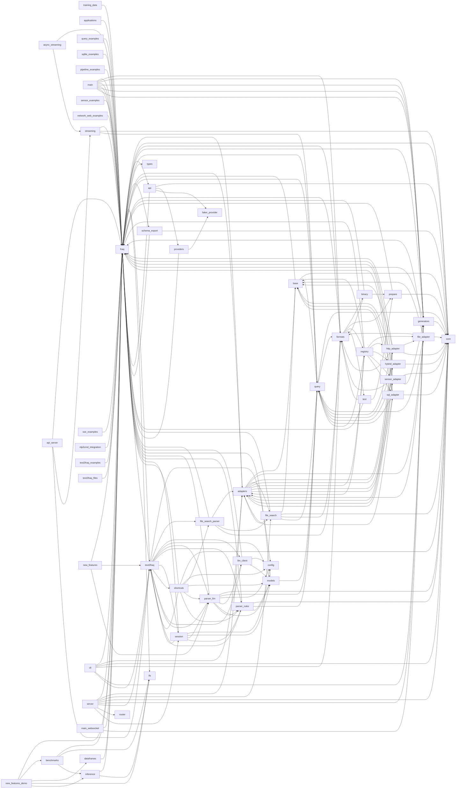

# fraq — Dependency Graph

> 70 modules, 197 dependency edges

## Module Dependencies

## Coupling Matrix

| | training_data | bash_examples | app_integrations | applications | async_streaming | query_examples | bash_examples | run | sqlite_examples | pipeline_examples | api_server | main | run | main | app | run | main | sensor_examples | network_web_examples | new_features_demo | nlp_examples | sse_examples | nlp2cmd_integration | text2fraq_examples | text2fraq_files | new_features | main | run | fraq | adapters | base | file_adapter | file_search | http_adapter | hybrid_adapter | registry | sensor_adapter | sql_adapter | api | benchmarks | cli | core | dataframes | formats | binary | prepare | registry | text | generators | ifs | inference | providers | faker_provider | query | schema_export | server | streaming | text2fraq | config | file_search_parser | llm_client | models | parser_llm | parser_rules | router | session | shortcuts | types | main_websocket | project |
| --- | --- | --- | --- | --- | --- | --- | --- | --- | --- | --- | --- | --- | --- | --- | --- | --- | --- | --- | --- | --- | --- | --- | --- | --- | --- | --- | --- | --- | --- | --- | --- | --- | --- | --- | --- | --- | --- | --- | --- | --- | --- | --- | --- | --- | --- | --- | --- | --- | --- | --- | --- | --- | --- | --- | --- | --- | --- | --- | --- | --- | --- | --- | --- | --- | --- | --- | --- | --- | --- | --- |
| **training_data** | · |  |  |  |  |  |  |  |  |  |  |  |  |  |  |  |  |  |  |  |  |  |  |  |  |  |  |  | → |  |  |  |  |  |  |  |  |  |  |  |  |  |  |  |  |  |  |  |  |  |  |  |  |  |  |  |  |  |  |  |  |  |  |  |  |  |  |  |  |  |
| **bash_examples** |  | · |  |  |  |  |  |  |  |  |  |  |  |  |  |  |  |  |  |  |  |  |  |  |  |  |  |  |  |  |  |  |  |  |  |  |  |  |  |  |  |  |  |  |  |  |  |  |  |  |  |  |  |  |  |  |  |  |  |  |  |  |  |  |  |  |  |  |  |  |
| **app_integrations** |  |  | · |  |  |  |  |  |  |  |  |  |  |  |  |  |  |  |  |  |  |  |  |  |  |  |  |  |  |  |  |  |  |  |  |  |  |  |  |  |  |  |  |  |  |  |  |  |  |  |  |  |  |  |  |  |  |  |  |  |  |  |  |  |  |  |  |  |  |  |
| **applications** |  |  |  | · |  |  |  |  |  |  |  |  |  |  |  |  |  |  |  |  |  |  |  |  |  |  |  |  | → |  |  |  |  |  |  |  |  |  |  |  |  |  |  |  |  |  |  |  |  |  |  |  |  |  |  |  |  |  |  |  |  |  |  |  |  |  |  |  |  |  |
| **async_streaming** |  |  |  |  | · |  |  |  |  |  |  |  |  |  |  |  |  |  |  |  |  |  |  |  |  |  |  |  | → |  |  |  |  |  |  |  |  |  |  |  |  |  |  |  |  |  |  |  |  |  |  |  |  |  |  |  | → |  |  |  |  |  |  |  |  |  |  |  |  |  |
| **query_examples** |  |  |  |  |  | · |  |  |  |  |  |  |  |  |  |  |  |  |  |  |  |  |  |  |  |  |  |  | → |  |  |  |  |  |  |  |  |  |  |  |  |  |  |  |  |  |  |  |  |  |  |  |  |  |  |  |  |  |  |  |  |  |  |  |  |  |  |  |  |  |
| **bash_examples** |  |  |  |  |  |  | · |  |  |  |  |  |  |  |  |  |  |  |  |  |  |  |  |  |  |  |  |  |  |  |  |  |  |  |  |  |  |  |  |  |  |  |  |  |  |  |  |  |  |  |  |  |  |  |  |  |  |  |  |  |  |  |  |  |  |  |  |  |  |  |
| **run** |  |  |  |  |  |  |  | · |  |  |  |  |  |  |  |  |  |  |  |  |  |  |  |  |  |  |  |  |  |  |  |  |  |  |  |  |  |  |  |  |  |  |  |  |  |  |  |  |  |  |  |  |  |  |  |  |  |  |  |  |  |  |  |  |  |  |  |  |  |  |
| **sqlite_examples** |  |  |  |  |  |  |  |  | · |  |  |  |  |  |  |  |  |  |  |  |  |  |  |  |  |  |  |  | → |  |  |  |  |  |  |  |  |  |  |  |  |  |  |  |  |  |  |  |  |  |  |  |  |  |  |  |  |  |  |  |  |  |  |  |  |  |  |  |  |  |
| **pipeline_examples** |  |  |  |  |  |  |  |  |  | · |  |  |  |  |  |  |  |  |  |  |  |  |  |  |  |  |  |  | → |  |  |  |  |  |  |  |  |  |  |  |  |  |  |  |  |  |  |  |  |  |  |  |  |  |  |  |  |  |  |  |  |  |  |  |  |  |  |  |  |  |
| **api_server** |  |  |  |  |  |  |  |  |  |  | · |  |  |  |  |  |  |  |  |  |  |  |  |  |  |  |  |  | → |  |  |  |  |  |  |  |  |  |  |  |  |  |  |  |  |  |  |  |  |  |  |  |  |  |  |  | → | → |  |  |  |  |  |  |  |  |  |  |  |  |
| **main** |  |  |  |  |  |  |  |  |  |  |  | · |  |  |  |  |  |  |  |  |  |  |  |  |  |  |  |  | → |  |  |  |  |  |  |  |  |  |  |  |  |  |  | → |  |  |  |  | → |  |  |  |  |  |  |  |  |  |  |  |  |  |  |  |  |  |  |  |  |  |
| **run** |  |  |  |  |  |  |  |  |  |  |  |  | · |  |  |  |  |  |  |  |  |  |  |  |  |  |  |  |  |  |  |  |  |  |  |  |  |  |  |  |  |  |  |  |  |  |  |  |  |  |  |  |  |  |  |  |  |  |  |  |  |  |  |  |  |  |  |  |  |  |
| **main** |  |  |  |  |  |  |  |  |  |  |  |  |  | · |  |  |  |  |  |  |  |  |  |  |  |  |  |  | → |  |  |  |  |  |  |  |  |  |  |  |  |  |  |  |  |  |  |  | → |  |  |  |  |  |  |  |  |  |  |  |  |  |  |  |  |  |  |  |  |  |
| **app** |  |  |  |  |  |  |  |  |  |  |  |  |  |  | · |  |  |  |  |  |  |  |  |  |  |  |  |  |  |  |  |  |  |  |  |  |  |  |  |  |  |  |  |  |  |  |  |  |  |  |  |  |  |  |  |  |  |  |  |  |  |  |  |  |  |  |  |  |  |  |
| **run** |  |  |  |  |  |  |  |  |  |  |  |  |  |  |  | · |  |  |  |  |  |  |  |  |  |  |  |  |  |  |  |  |  |  |  |  |  |  |  |  |  |  |  |  |  |  |  |  |  |  |  |  |  |  |  |  |  |  |  |  |  |  |  |  |  |  |  |  |  |  |
| **main** |  |  |  |  |  |  |  |  |  |  |  |  |  |  |  |  | · |  |  |  |  |  |  |  |  |  |  |  | → |  |  |  |  |  |  |  |  |  |  |  |  |  |  |  |  |  |  |  | → |  |  |  |  |  |  |  |  |  |  |  |  |  |  |  |  |  |  |  |  |  |
| **sensor_examples** |  |  |  |  |  |  |  |  |  |  |  |  |  |  |  |  |  | · |  |  |  |  |  |  |  |  |  |  | → |  |  |  |  |  |  |  |  |  |  |  |  |  |  |  |  |  |  |  |  |  |  |  |  |  |  |  |  |  |  |  |  |  |  |  |  |  |  |  |  |  |
| **network_web_examples** |  |  |  |  |  |  |  |  |  |  |  |  |  |  |  |  |  |  | · |  |  |  |  |  |  |  |  |  | → |  |  |  |  |  |  |  |  |  |  |  |  |  |  |  |  |  |  |  |  |  |  |  |  |  |  |  |  |  |  |  |  |  |  |  |  |  |  |  |  |  |
| **new_features_demo** |  |  |  |  |  |  |  |  |  |  |  |  |  |  |  |  |  |  |  | · |  |  |  |  |  |  |  |  | → |  |  |  |  |  |  |  |  |  |  | → |  |  | → |  |  |  |  |  |  | → | → |  |  |  |  |  |  |  |  |  |  |  |  |  |  |  |  |  |  |  |
| **nlp_examples** |  |  |  |  |  |  |  |  |  |  |  |  |  |  |  |  |  |  |  |  | · |  |  |  |  |  |  |  |  |  |  |  |  |  |  |  |  |  |  |  |  |  |  |  |  |  |  |  |  |  |  |  |  |  |  |  |  |  |  |  |  |  |  |  |  |  |  |  |  |  |
| **sse_examples** |  |  |  |  |  |  |  |  |  |  |  |  |  |  |  |  |  |  |  |  |  | · |  |  |  |  |  |  | → |  |  |  |  |  |  |  |  |  |  |  |  |  |  |  |  |  |  |  |  |  |  |  |  |  |  |  |  |  |  |  |  |  |  |  |  |  |  |  |  |  |
| **nlp2cmd_integration** |  |  |  |  |  |  |  |  |  |  |  |  |  |  |  |  |  |  |  |  |  |  | · |  |  |  |  |  | → |  |  |  |  |  |  |  |  |  |  |  |  |  |  |  |  |  |  |  |  |  |  |  |  |  |  |  |  |  |  |  |  |  |  |  |  |  |  |  |  |  |
| **text2fraq_examples** |  |  |  |  |  |  |  |  |  |  |  |  |  |  |  |  |  |  |  |  |  |  |  | · |  |  |  |  | → |  |  |  |  |  |  |  |  |  |  |  |  |  |  |  |  |  |  |  |  |  |  |  |  |  |  |  |  |  |  |  |  |  |  |  |  |  |  |  |  |  |
| **text2fraq_files** |  |  |  |  |  |  |  |  |  |  |  |  |  |  |  |  |  |  |  |  |  |  |  |  | · |  |  |  | → |  |  |  |  |  |  |  |  |  |  |  |  |  |  |  |  |  |  |  |  |  |  |  |  |  |  |  |  |  |  |  |  |  |  |  |  |  |  |  |  |  |
| **new_features** |  |  |  |  |  |  |  |  |  |  |  |  |  |  |  |  |  |  |  |  |  |  |  |  |  | · |  |  | → |  |  |  |  |  |  |  |  |  |  |  |  |  |  |  |  |  |  |  |  |  |  |  |  |  |  |  |  | → |  |  |  |  | → |  |  |  |  |  |  |  |
| **main** |  |  |  |  |  |  |  |  |  |  |  |  |  |  |  |  |  |  |  |  |  |  |  |  |  |  | · |  | → |  |  |  |  |  |  |  |  |  |  |  |  |  |  |  |  |  |  |  | → |  |  |  |  |  |  |  |  |  |  |  |  |  |  |  |  |  |  |  |  |  |
| **run** |  |  |  |  |  |  |  |  |  |  |  |  |  |  |  |  |  |  |  |  |  |  |  |  |  |  |  | · |  |  |  |  |  |  |  |  |  |  |  |  |  |  |  |  |  |  |  |  |  |  |  |  |  |  |  |  |  |  |  |  |  |  |  |  |  |  |  |  |  |  |
| **fraq** |  |  |  |  |  |  |  |  |  |  |  |  |  |  |  |  |  |  |  |  |  |  |  |  |  |  |  |  | · | → |  |  |  |  |  |  |  |  | → |  |  | → |  | → |  |  |  |  | → | → |  |  |  | → | → |  |  | → |  |  |  |  |  |  |  |  |  | → |  |  |
| **adapters** |  |  |  |  |  |  |  |  |  |  |  |  |  |  |  |  |  |  |  |  |  |  |  |  |  |  |  |  | → | · | → | → | → | → | → | → | → | → |  |  |  |  |  |  |  |  |  |  |  |  |  |  |  |  |  |  |  |  |  |  |  |  |  |  |  |  |  |  |  |  |
| **base** |  |  |  |  |  |  |  |  |  |  |  |  |  |  |  |  |  |  |  |  |  |  |  |  |  |  |  |  | → |  | · |  |  |  |  |  |  |  |  |  |  | → |  |  |  |  |  |  |  |  |  |  |  | → |  |  |  |  |  |  |  |  |  |  |  |  |  |  |  |  |
| **file_adapter** |  |  |  |  |  |  |  |  |  |  |  |  |  |  |  |  |  |  |  |  |  |  |  |  |  |  |  |  | → | → | → | · |  |  |  |  |  |  |  |  |  | → |  | → |  |  |  |  |  |  |  |  |  | → |  |  |  |  |  |  |  |  |  |  |  |  |  |  |  |  |
| **file_search** |  |  |  |  |  |  |  |  |  |  |  |  |  |  |  |  |  |  |  |  |  |  |  |  |  |  |  |  | → | → | → |  | · |  |  |  |  |  |  |  |  | → |  | → |  |  |  |  |  |  |  |  |  | → |  |  |  |  |  |  |  |  |  |  |  |  |  |  |  |  |
| **http_adapter** |  |  |  |  |  |  |  |  |  |  |  |  |  |  |  |  |  |  |  |  |  |  |  |  |  |  |  |  | → | → | → | → |  | · |  |  |  |  |  |  |  | → |  | → |  |  |  |  |  |  |  |  |  | → |  |  |  |  |  |  |  |  |  |  |  |  |  |  |  |  |
| **hybrid_adapter** |  |  |  |  |  |  |  |  |  |  |  |  |  |  |  |  |  |  |  |  |  |  |  |  |  |  |  |  | → | → | → |  |  |  | · |  |  |  |  |  |  | → |  |  |  |  |  |  |  |  |  |  |  | → |  |  |  |  |  |  |  |  |  |  |  |  |  |  |  |  |
| **registry** |  |  |  |  |  |  |  |  |  |  |  |  |  |  |  |  |  |  |  |  |  |  |  |  |  |  |  |  | → | → | → | → |  | → | → | · | → | → |  |  |  |  |  |  |  |  |  |  |  |  |  |  |  | → |  |  |  |  |  |  |  |  |  |  |  |  |  |  |  |  |
| **sensor_adapter** |  |  |  |  |  |  |  |  |  |  |  |  |  |  |  |  |  |  |  |  |  |  |  |  |  |  |  |  | → | → | → |  |  |  |  |  | · |  |  |  |  | → |  | → |  |  |  |  | → |  |  |  |  | → |  |  |  |  |  |  |  |  |  |  |  |  |  |  |  |  |
| **sql_adapter** |  |  |  |  |  |  |  |  |  |  |  |  |  |  |  |  |  |  |  |  |  |  |  |  |  |  |  |  | → | → | → |  |  |  |  |  |  | · |  |  |  | → |  |  |  |  |  |  |  |  |  |  |  | → |  |  |  |  |  |  |  |  |  |  |  |  |  |  |  |  |
| **api** |  |  |  |  |  |  |  |  |  |  |  |  |  |  |  |  |  |  |  |  |  |  |  |  |  |  |  |  | → |  |  |  |  |  |  |  |  |  | · |  |  | → |  |  |  |  |  |  |  |  |  | → | → |  |  |  |  |  |  |  |  |  |  |  |  |  |  |  |  |  |
| **benchmarks** |  |  |  |  |  |  |  |  |  |  |  |  |  |  |  |  |  |  |  |  |  |  |  |  |  |  |  |  | → |  |  |  |  |  |  |  |  |  |  | · |  |  |  |  |  |  |  |  |  | → | → |  |  |  |  |  |  |  |  |  |  |  |  |  |  |  |  |  |  |  |
| **cli** |  |  |  |  |  |  |  |  |  |  |  |  |  |  |  |  |  |  |  |  |  |  |  |  |  |  |  |  | → | → |  |  |  |  |  |  |  |  |  |  | · | → |  | → |  |  |  |  | → |  |  |  |  |  |  |  |  | → |  |  |  |  |  |  |  |  |  |  |  |  |
| **core** |  |  |  |  |  |  |  |  |  |  |  |  |  |  |  |  |  |  |  |  |  |  |  |  |  |  |  |  |  |  |  |  |  |  |  |  |  |  |  |  |  | · |  |  |  |  |  |  |  |  |  |  |  |  |  |  |  |  |  |  |  |  |  |  |  |  |  |  |  |  |
| **dataframes** |  |  |  |  |  |  |  |  |  |  |  |  |  |  |  |  |  |  |  |  |  |  |  |  |  |  |  |  | → |  |  |  |  |  |  |  |  |  |  |  |  |  | · |  |  |  |  |  |  |  |  |  |  |  |  |  |  |  |  |  |  |  |  |  |  |  |  |  |  |  |
| **formats** |  |  |  |  |  |  |  |  |  |  |  |  |  |  |  |  |  |  |  |  |  |  |  |  |  |  |  |  | → |  |  |  |  |  |  |  |  |  |  |  |  |  |  | · | → | → | → | → |  |  |  |  |  |  |  |  |  |  |  |  |  |  |  |  |  |  |  |  |  |  |
| **binary** |  |  |  |  |  |  |  |  |  |  |  |  |  |  |  |  |  |  |  |  |  |  |  |  |  |  |  |  | → |  |  |  |  |  |  |  |  |  |  |  |  |  |  | → | · | → |  |  |  |  |  |  |  |  |  |  |  |  |  |  |  |  |  |  |  |  |  |  |  |  |
| **prepare** |  |  |  |  |  |  |  |  |  |  |  |  |  |  |  |  |  |  |  |  |  |  |  |  |  |  |  |  | → |  |  |  |  |  |  |  |  |  |  |  |  | → |  |  |  | · |  |  |  |  |  |  |  |  |  |  |  |  |  |  |  |  |  |  |  |  |  |  |  |  |
| **registry** |  |  |  |  |  |  |  |  |  |  |  |  |  |  |  |  |  |  |  |  |  |  |  |  |  |  |  |  |  |  |  |  |  |  |  |  |  |  |  |  |  |  |  |  |  |  | · |  |  |  |  |  |  |  |  |  |  |  |  |  |  |  |  |  |  |  |  |  |  |  |
| **text** |  |  |  |  |  |  |  |  |  |  |  |  |  |  |  |  |  |  |  |  |  |  |  |  |  |  |  |  | → |  |  |  |  |  |  |  |  |  |  |  |  |  |  | → |  | → |  | · |  |  |  |  |  |  |  |  |  |  |  |  |  |  |  |  |  |  |  |  |  |  |
| **generators** |  |  |  |  |  |  |  |  |  |  |  |  |  |  |  |  |  |  |  |  |  |  |  |  |  |  |  |  | → |  |  |  |  |  |  |  |  |  |  |  |  | → |  |  |  |  |  |  | · |  |  |  |  |  |  |  |  |  |  |  |  |  |  |  |  |  |  |  |  |  |
| **ifs** |  |  |  |  |  |  |  |  |  |  |  |  |  |  |  |  |  |  |  |  |  |  |  |  |  |  |  |  |  |  |  |  |  |  |  |  |  |  |  |  |  |  |  |  |  |  |  |  |  | · |  |  |  |  |  |  |  |  |  |  |  |  |  |  |  |  |  |  |  |  |
| **inference** |  |  |  |  |  |  |  |  |  |  |  |  |  |  |  |  |  |  |  |  |  |  |  |  |  |  |  |  | → |  |  |  |  |  |  |  |  |  |  |  |  |  |  |  |  |  |  |  |  | → | · |  |  |  |  |  |  |  |  |  |  |  |  |  |  |  |  |  |  |  |
| **providers** |  |  |  |  |  |  |  |  |  |  |  |  |  |  |  |  |  |  |  |  |  |  |  |  |  |  |  |  | → |  |  |  |  |  |  |  |  |  |  |  |  |  |  |  |  |  |  |  |  |  |  | · | → |  |  |  |  |  |  |  |  |  |  |  |  |  |  |  |  |  |
| **faker_provider** |  |  |  |  |  |  |  |  |  |  |  |  |  |  |  |  |  |  |  |  |  |  |  |  |  |  |  |  |  |  |  |  |  |  |  |  |  |  |  |  |  |  |  |  |  |  |  |  |  |  |  |  | · |  |  |  |  |  |  |  |  |  |  |  |  |  |  |  |  |  |
| **query** |  |  |  |  |  |  |  |  |  |  |  |  |  |  |  |  |  |  |  |  |  |  |  |  |  |  |  |  | → |  |  |  |  |  |  |  |  |  |  |  |  | → |  | → |  |  |  |  |  |  |  |  |  | · |  |  |  |  |  |  |  |  |  |  |  |  |  |  |  |  |
| **schema_export** |  |  |  |  |  |  |  |  |  |  |  |  |  |  |  |  |  |  |  |  |  |  |  |  |  |  |  |  | → |  |  |  |  |  |  |  |  |  |  |  |  | → |  |  |  |  |  |  |  |  |  |  |  |  | · |  |  |  |  |  |  |  |  |  |  |  |  |  |  |  |
| **server** |  |  |  |  |  |  |  |  |  |  |  |  |  |  |  |  |  |  |  |  |  |  |  |  |  |  |  |  | → | → |  |  | → |  |  |  |  |  |  |  |  | → |  |  |  |  |  |  | → |  |  |  |  |  |  | · |  | → |  |  |  |  |  |  | → | → |  |  |  |  |
| **streaming** |  |  |  |  |  |  |  |  |  |  |  |  |  |  |  |  |  |  |  |  |  |  |  |  |  |  |  |  | → |  |  |  |  |  |  |  |  |  |  |  |  | → |  |  |  |  |  |  |  |  |  |  |  | → |  |  | · |  |  |  |  |  |  |  |  |  |  |  |  |  |
| **text2fraq** |  |  |  |  |  |  |  |  |  |  |  |  |  |  |  |  |  |  |  |  |  |  |  |  |  |  |  |  | → |  |  |  |  |  |  |  |  |  |  |  |  |  |  |  |  |  |  |  |  |  |  |  |  |  |  |  |  | · | → | → | → | → | → | → |  | → | → |  |  |  |
| **config** |  |  |  |  |  |  |  |  |  |  |  |  |  |  |  |  |  |  |  |  |  |  |  |  |  |  |  |  |  |  |  |  |  |  |  |  |  |  |  |  |  |  |  |  |  |  |  |  |  |  |  |  |  |  |  |  |  |  | · |  |  |  |  |  |  |  |  |  |  |  |
| **file_search_parser** |  |  |  |  |  |  |  |  |  |  |  |  |  |  |  |  |  |  |  |  |  |  |  |  |  |  |  |  | → | → |  |  | → |  |  |  |  |  |  |  |  |  |  | → |  |  |  |  |  |  |  |  |  |  |  |  |  |  |  | · |  |  |  |  |  |  |  |  |  |  |
| **llm_client** |  |  |  |  |  |  |  |  |  |  |  |  |  |  |  |  |  |  |  |  |  |  |  |  |  |  |  |  | → |  |  |  |  |  |  |  |  |  |  |  |  |  |  |  |  |  |  |  |  |  |  |  |  |  |  |  |  | → | → |  | · | → |  |  |  |  |  |  |  |  |
| **models** |  |  |  |  |  |  |  |  |  |  |  |  |  |  |  |  |  |  |  |  |  |  |  |  |  |  |  |  | → |  |  |  |  |  |  |  |  |  |  |  |  |  |  |  |  |  |  |  |  |  |  |  |  | → |  |  |  |  |  |  |  | · |  |  |  |  |  |  |  |  |
| **parser_llm** |  |  |  |  |  |  |  |  |  |  |  |  |  |  |  |  |  |  |  |  |  |  |  |  |  |  |  |  | → |  |  |  |  |  |  |  |  |  |  |  |  | → |  |  |  |  |  |  |  |  |  |  |  | → |  |  |  | → | → |  | → | → | · | → |  |  |  |  |  |  |
| **parser_rules** |  |  |  |  |  |  |  |  |  |  |  |  |  |  |  |  |  |  |  |  |  |  |  |  |  |  |  |  | → |  |  |  |  |  |  |  |  |  |  |  |  | → |  |  |  |  |  |  |  |  |  |  |  | → |  |  |  | → |  |  |  | → |  | · |  |  |  |  |  |  |
| **router** |  |  |  |  |  |  |  |  |  |  |  |  |  |  |  |  |  |  |  |  |  |  |  |  |  |  |  |  |  |  |  |  |  |  |  |  |  |  |  |  |  |  |  |  |  |  |  |  |  |  |  |  |  |  |  |  |  |  |  |  |  |  |  |  | · |  |  |  |  |  |
| **session** |  |  |  |  |  |  |  |  |  |  |  |  |  |  |  |  |  |  |  |  |  |  |  |  |  |  |  |  | → |  |  |  |  |  |  |  |  |  |  |  |  |  |  |  |  |  |  |  |  |  |  |  |  |  |  |  |  | → | → |  |  | → | → | → |  | · |  |  |  |  |
| **shortcuts** |  |  |  |  |  |  |  |  |  |  |  |  |  |  |  |  |  |  |  |  |  |  |  |  |  |  |  |  | → |  |  |  |  |  |  |  |  |  |  |  |  | → |  |  |  |  |  |  |  |  |  |  |  |  |  |  |  | → | → | → |  | → | → | → |  |  | · |  |  |  |
| **types** |  |  |  |  |  |  |  |  |  |  |  |  |  |  |  |  |  |  |  |  |  |  |  |  |  |  |  |  |  |  |  |  |  |  |  |  |  |  |  |  |  |  |  |  |  |  |  |  |  |  |  |  |  |  |  |  |  |  |  |  |  |  |  |  |  |  |  | · |  |  |
| **main_websocket** |  |  |  |  |  |  |  |  |  |  |  |  |  |  |  |  |  |  |  |  |  |  |  |  |  |  |  |  | → |  |  |  |  |  |  |  |  |  |  |  |  |  |  |  |  |  |  |  | → |  |  |  |  |  |  |  |  |  |  |  |  |  |  |  |  |  |  |  | · |  |
| **project** |  |  |  |  |  |  |  |  |  |  |  |  |  |  |  |  |  |  |  |  |  |  |  |  |  |  |  |  |  |  |  |  |  |  |  |  |  |  |  |  |  |  |  |  |  |  |  |  |  |  |  |  |  |  |  |  |  |  |  |  |  |  |  |  |  |  |  |  |  | · |

## Fan-in / Fan-out

| Module | Fan-in | Fan-out |
|--------|--------|---------|
| `examples.ai_ml.training_data` | 0 | 1 |
| `examples.bash_examples` | 0 | 0 |
| `examples.basic.app_integrations` | 0 | 0 |
| `examples.basic.applications` | 0 | 1 |
| `examples.basic.async_streaming` | 0 | 2 |
| `examples.basic.query_examples` | 0 | 1 |
| `examples.cli-docker.bash_examples` | 0 | 0 |
| `examples.cli-docker.run` | 0 | 0 |
| `examples.database.sqlite_examples` | 0 | 1 |
| `examples.etl.pipeline_examples` | 0 | 1 |
| `examples.fastapi-docker.api_server` | 0 | 3 |
| `examples.fastapi-docker.main` | 0 | 3 |
| `examples.fastapi-docker.run` | 0 | 0 |
| `examples.fullstack-docker.api.main` | 0 | 2 |
| `examples.fullstack-docker.frontend.app` | 0 | 0 |
| `examples.fullstack-docker.run` | 0 | 0 |
| `examples.fullstack-docker.websocket.main` | 0 | 2 |
| `examples.iot.sensor_examples` | 0 | 1 |
| `examples.network.network_web_examples` | 0 | 1 |
| `examples.new_features_demo` | 0 | 5 |
| `examples.nlp_examples` | 0 | 0 |
| `examples.streaming.sse_examples` | 0 | 1 |
| `examples.text2fraq.nlp2cmd_integration` | 0 | 1 |
| `examples.text2fraq.text2fraq_examples` | 0 | 1 |
| `examples.text2fraq.text2fraq_files` | 0 | 1 |
| `examples.v028.new_features` | 0 | 3 |
| `examples.websocket-docker.main` | 0 | 2 |
| `examples.websocket-docker.run` | 0 | 0 |
| `fraq` | 52 | 10 |
| `fraq.adapters` | 11 | 9 |
| `fraq.adapters.base` | 8 | 3 |
| `fraq.adapters.file_adapter` | 3 | 6 |
| `fraq.adapters.file_search` | 3 | 6 |
| `fraq.adapters.http_adapter` | 2 | 7 |
| `fraq.adapters.hybrid_adapter` | 2 | 5 |
| `fraq.adapters.registry` | 1 | 9 |
| `fraq.adapters.sensor_adapter` | 2 | 7 |
| `fraq.adapters.sql_adapter` | 2 | 5 |
| `fraq.api` | 1 | 4 |
| `fraq.benchmarks` | 1 | 3 |
| `fraq.cli` | 0 | 6 |
| `fraq.core` | 19 | 0 |
| `fraq.dataframes` | 1 | 1 |
| `fraq.formats` | 11 | 5 |
| `fraq.formats.binary` | 1 | 3 |
| `fraq.formats.prepare` | 3 | 2 |
| `fraq.formats.registry` | 1 | 0 |
| `fraq.formats.text` | 1 | 3 |
| `fraq.generators` | 9 | 2 |
| `fraq.ifs` | 4 | 0 |
| `fraq.inference` | 2 | 2 |
| `fraq.providers` | 1 | 2 |
| `fraq.providers.faker_provider` | 2 | 0 |
| `fraq.query` | 13 | 3 |
| `fraq.schema_export` | 1 | 2 |
| `fraq.server` | 0 | 8 |
| `fraq.streaming` | 2 | 3 |
| `fraq.text2fraq` | 10 | 9 |
| `fraq.text2fraq.config` | 5 | 0 |
| `fraq.text2fraq.file_search_parser` | 2 | 4 |
| `fraq.text2fraq.llm_client` | 2 | 4 |
| `fraq.text2fraq.models` | 6 | 2 |
| `fraq.text2fraq.parser_llm` | 4 | 8 |
| `fraq.text2fraq.parser_rules` | 4 | 5 |
| `fraq.text2fraq.router` | 1 | 0 |
| `fraq.text2fraq.session` | 2 | 6 |
| `fraq.text2fraq.shortcuts` | 1 | 8 |
| `fraq.types` | 1 | 0 |
| `main_websocket` | 0 | 2 |
| `project` | 0 | 0 |
