# System Architecture Analysis

## Overview

- **Project**: /home/tom/github/wronai/fraq
- **Primary Language**: python
- **Languages**: python: 89, shell: 4
- **Analysis Mode**: static
- **Total Functions**: 439
- **Total Classes**: 59
- **Modules**: 93
- **Entry Points**: 353

## Architecture by Module

### fraq.cli
- **Functions**: 24
- **File**: `cli.py`

### fraq.api
- **Functions**: 18
- **Classes**: 2
- **File**: `api.py`

### fraq.adapters.file_search
- **Functions**: 18
- **Classes**: 3
- **File**: `file_search.py`

### fraq.core
- **Functions**: 17
- **Classes**: 4
- **File**: `core.py`

### fraq.text2fraq.file_search_parser
- **Functions**: 14
- **Classes**: 1
- **File**: `file_search_parser.py`

### examples.fastapi-docker.api_server
- **Functions**: 13
- **File**: `api_server.py`

### fraq.providers.faker_provider
- **Functions**: 13
- **Classes**: 3
- **File**: `faker_provider.py`

### fraq.query
- **Functions**: 12
- **Classes**: 4
- **File**: `query.py`

### fraq.formats.binary
- **Functions**: 11
- **File**: `binary.py`

### examples.text2fraq.nlp2cmd_integration
- **Functions**: 11
- **File**: `nlp2cmd_integration.py`

### fraq.benchmarks
- **Functions**: 11
- **Classes**: 4
- **File**: `benchmarks.py`

### examples.text2fraq.text2fraq_examples
- **Functions**: 11
- **File**: `text2fraq_examples.py`

### fraq.ifs
- **Functions**: 11
- **Classes**: 5
- **File**: `ifs.py`

### examples.integrations.cli_chat_example
- **Functions**: 10
- **Classes**: 1
- **File**: `cli_chat_example.py`

### fraq.generators
- **Functions**: 9
- **Classes**: 4
- **File**: `generators.py`

### fraq.text2fraq.parser_rules
- **Functions**: 8
- **Classes**: 1
- **File**: `parser_rules.py`

### fraq.text2fraq.session
- **Functions**: 8
- **Classes**: 1
- **File**: `session.py`

### fraq.inference.dimension
- **Functions**: 8
- **Classes**: 2
- **File**: `dimension.py`

### fraq.text2fraq.parser_llm
- **Functions**: 7
- **Classes**: 1
- **File**: `parser_llm.py`

### fraq.inference.hierarchy
- **Functions**: 7
- **Classes**: 2
- **File**: `hierarchy.py`

## Key Entry Points

Main execution flows into the system:

### examples.text2fraq.text2fraq_files.example_pdf_search_with_llm
> Wyszukiwanie PDF z użyciem LLM (qwen2.5).
- **Calls**: print, print, print, os.path.expanduser, Text2FraqConfig, print, os.path.exists, Text2Fraq

### examples.websocket-docker.main.ws_files
> Stream file search results
- **Calls**: app.websocket, websocket.accept, msg.get, print, websocket.receive_json, msg.get, msg.get, msg.get

### fraq.inference.FractalAnalyzer.analyze_correlations
> Analyze correlations between columns for fractal relationships.
- **Calls**: list, enumerate, None.keys, sum, math.sqrt, math.sqrt, float, float

### fraq.inference.FractalAnalyzer.detect_hierarchy
> Detect hierarchical structure in data.

Analyzes parent-child relationships to find fractal hierarchy patterns.
- **Calls**: None.keys, self.box_counting_dimension, max, sorted, min, PatternSignature, row.get, float

### fraq.inference.FractalAnalyzer.box_counting_dimension
> Calculate box-counting dimension of value distribution.

True fractals have non-integer dimensions (1.0 < d < 2.0 for curves).
- **Calls**: FractalDimension, FractalDimension, min, max, FractalDimension, set, scales.append, len

### fraq.cli.cmd_network_scan
> Scan network for devices.
- **Calls**: NetworkAdapter, print, print, print, print, adapter.search, print, int

### fraq.cli.cmd_web_crawl
> Crawl website.
- **Calls**: WebCrawlerAdapter, print, print, print, print, adapter.search, print, print

### examples.fastapi-docker.api_server.query_data
> Execute fractal query with typed fields.
- **Calls**: app.get, Query, Query, Query, Query, Query, tuple, FraqNode

### examples.fastapi-docker.api_server.ws_files
> WebSocket for file search streaming.
- **Calls**: app.websocket, websocket.accept, msg.get, print, websocket.receive_json, msg.get, msg.get, msg.get

### examples.fastapi-docker.api_server.schema_records
> Generate typed schema records.
- **Calls**: app.get, Query, Query, Query, Query, Query, tuple, FraqNode

### examples.text2fraq.nlp2cmd_integration.example_full_nlp2cmd_workflow
> Pełny workflow: FraqSchema → NLP2CMD SchemaRegistry → Natural Language → Command.

W produkcji:
    1. Zdefiniuj FraqSchema
    2. Wyeksportuj to_nlp2
- **Calls**: examples.text2fraq.nlp2cmd_integration.build_sensor_schema, fraq.export.nlp2cmd.to_nlp2cmd_schema, fraq.export.nlp2cmd.to_nlp2cmd_actions, print, print, print, print, None.take

### examples.fastapi-docker.api_server.stream
> Stream cursor records.
- **Calls**: app.get, Query, Query, Query, tuple, FraqNode, root.cursor, range

### examples.fastapi-docker.api_server.files_stat
> Get file statistics with fractal coordinates.
- **Calls**: app.get, None.expanduser, path.stat, path.exists, HTTPException, str, None.isoformat, Path

### examples.text2fraq.text2fraq_examples.example_full_pipeline
> Full pipeline NL → parse → execute / file search.
- **Calls**: examples.text2fraq.text2fraq_examples._print_header, None.parse, examples.text2fraq.text2fraq_examples._print_parsed_query, FileSearchText2Fraq, file_search.parse, examples.text2fraq.text2fraq_examples._print_file_params, file_search.search, print

### examples.new_features_demo.example_5_fractal_inference
> Example 5: Infer fractal schema from real data.
- **Calls**: print, print, print, range, print, fraq.inference.infer_fractal, print, schema.patterns.items

### examples.text2fraq.text2fraq_files.example_pdf_search_rule_based
> Wyszukiwanie PDF bez LLM - rule based.
- **Calls**: print, print, print, os.path.expanduser, FileSearchText2Fraq, print, os.path.exists, print

### examples.websocket-docker.main.ws_stream
> Stream fractal data
- **Calls**: app.websocket, websocket.accept, msg.get, print, websocket.receive_json, msg.get, msg.get, FraqNode

### examples.streaming.sse_examples.example_1_sse
> SSE - UPROSZCZONE.
- **Calls**: print, print, print, asyncio.run, print, fraq.inference.schema.InferredSchema.generate, enumerate, generate_sse

### examples.fastapi-docker.api_server.files_search
> Search files with fractal metadata.
- **Calls**: app.get, Query, Query, Query, Query, Query, Query, Query

### fraq.server.ws_stream
> WebSocket endpoint for streaming fractal data.
- **Calls**: app.websocket, websocket.accept, FraqNode, FraqCursor, data.get, HashGenerator, websocket.receive_json, data.get

### fraq.text2fraq.config.Text2FraqConfig.from_env
> Load config from environment variables.
- **Calls**: cls, os.getenv, os.getenv, os.getenv, os.getenv, float, int, int

### examples.text2fraq.text2fraq_files.example_convenience_function
> Użycie funkcji text2filesearch.
- **Calls**: print, print, print, os.path.expanduser, print, print, os.path.exists, print

### examples.integrations.jupyter_example.jupyter_visualization
> Visualize fraq data in Jupyter.
- **Calls**: fraq.inference.schema.InferredSchema.generate, pd.DataFrame, plt.subplots, None.scatter, None.set_title, None.set_xlabel, None.set_ylabel, None.hist

### examples.etl.pipeline_examples.example_2_transform
> Transform - UPROSZCZONE.
- **Calls**: print, print, print, fraq.inference.schema.InferredSchema.generate, print, processed.append, print, round

### examples.fastapi-docker.api_server.explore
> Zoom into fractal at given depth.
- **Calls**: app.get, Query, Query, Query, Query, tuple, FraqNode, root.zoom

### examples.integrations.jupyter_example.jupyter_interactive_widget
> Interactive widget for fraq in Jupyter.
- **Calls**: interact, fraq.inference.schema.InferredSchema.generate, pd.DataFrame, plt.subplots, ax.plot, ax.plot, ax.set_title, ax.legend

### examples.integrations.websocket_example.fraq_websocket_handler
> Handle WebSocket connections and stream fraq data.
- **Calls**: json.loads, data.get, print, print, data.get, data.get, fraq.adapters.sensor_adapter.SensorAdapter.stream, websocket.send

### examples.integrations.cli_chat_example.FraqChat.do_generate
> Generate data: generate <field:type> [count=N]
- **Calls**: arg.split, print, fraq.inference.schema.InferredSchema.generate, enumerate, print, print, a.startswith, print

### fraq.adapters.file_search.FileSearchAdapter.load_root
- **Calls**: self._fs.stat, FraqNode, None.resolve, int, float, float, hash, None.expanduser

### fraq.text2fraq.file_search_parser.FileSearchText2Fraq._apply_filters
> Apply date filters and build file info. CC≤3
- **Calls**: file_path.stat, result.append, str, None.lower, len, float, float, hash

## Process Flows

Key execution flows identified:

### Flow 1: example_pdf_search_with_llm
```
example_pdf_search_with_llm [examples.text2fraq.text2fraq_files]
```

### Flow 2: ws_files
```
ws_files [examples.websocket-docker.main]
```

### Flow 3: analyze_correlations
```
analyze_correlations [fraq.inference.FractalAnalyzer]
```

### Flow 4: detect_hierarchy
```
detect_hierarchy [fraq.inference.FractalAnalyzer]
```

### Flow 5: box_counting_dimension
```
box_counting_dimension [fraq.inference.FractalAnalyzer]
```

### Flow 6: cmd_network_scan
```
cmd_network_scan [fraq.cli]
```

### Flow 7: cmd_web_crawl
```
cmd_web_crawl [fraq.cli]
```

### Flow 8: query_data
```
query_data [examples.fastapi-docker.api_server]
```

### Flow 9: schema_records
```
schema_records [examples.fastapi-docker.api_server]
```

### Flow 10: example_full_nlp2cmd_workflow
```
example_full_nlp2cmd_workflow [examples.text2fraq.nlp2cmd_integration]
  └─> build_sensor_schema
  └─ →> to_nlp2cmd_schema
  └─ →> to_nlp2cmd_actions
```

## Key Classes

### fraq.text2fraq.file_search_parser.FileSearchText2Fraq
> Natural language to file search converter.
- **Methods**: 14
- **Key Methods**: fraq.text2fraq.file_search_parser.FileSearchText2Fraq.__init__, fraq.text2fraq.file_search_parser.FileSearchText2Fraq._detect_path, fraq.text2fraq.file_search_parser.FileSearchText2Fraq._should_exclude, fraq.text2fraq.file_search_parser.FileSearchText2Fraq._collect_files, fraq.text2fraq.file_search_parser.FileSearchText2Fraq._apply_filters, fraq.text2fraq.file_search_parser.FileSearchText2Fraq._sort_and_limit, fraq.text2fraq.file_search_parser.FileSearchText2Fraq._collect_files_filtered, fraq.text2fraq.file_search_parser.FileSearchText2Fraq.parse, fraq.text2fraq.file_search_parser.FileSearchText2Fraq._detect_extension, fraq.text2fraq.file_search_parser.FileSearchText2Fraq._detect_limit

### fraq.adapters.file_search.FileSearchAdapter
> Adapter for searching files on disk using fractal patterns.

Uses Port/Adapter pattern - all I/O goe
- **Methods**: 10
- **Key Methods**: fraq.adapters.file_search.FileSearchAdapter.__init__, fraq.adapters.file_search.FileSearchAdapter.load_root, fraq.adapters.file_search.FileSearchAdapter._build_glob, fraq.adapters.file_search.FileSearchAdapter._file_to_record, fraq.adapters.file_search.FileSearchAdapter._sort_and_limit, fraq.adapters.file_search.FileSearchAdapter._filter_by_time, fraq.adapters.file_search.FileSearchAdapter._collect_files, fraq.adapters.file_search.FileSearchAdapter.search, fraq.adapters.file_search.FileSearchAdapter.save, fraq.adapters.file_search.FileSearchAdapter.stream
- **Inherits**: BaseAdapter

### examples.integrations.cli_chat_example.FraqChat
> Interactive CLI for fraq operations.
- **Methods**: 9
- **Key Methods**: examples.integrations.cli_chat_example.FraqChat.__init__, examples.integrations.cli_chat_example.FraqChat.do_generate, examples.integrations.cli_chat_example.FraqChat.do_stream, examples.integrations.cli_chat_example.FraqChat.do_schema, examples.integrations.cli_chat_example.FraqChat.do_save, examples.integrations.cli_chat_example.FraqChat.do_stats, examples.integrations.cli_chat_example.FraqChat.do_quit, examples.integrations.cli_chat_example.FraqChat.do_EOF, examples.integrations.cli_chat_example.FraqChat.emptyline
- **Inherits**: cmd.Cmd

### fraq.text2fraq.session.FraqSession
> Multi-turn conversation with context memory.
- **Methods**: 8
- **Key Methods**: fraq.text2fraq.session.FraqSession.__post_init__, fraq.text2fraq.session.FraqSession.ask, fraq.text2fraq.session.FraqSession._is_followup, fraq.text2fraq.session.FraqSession._modify_last, fraq.text2fraq.session.FraqSession._detect_new_fields, fraq.text2fraq.session.FraqSession._update_context, fraq.text2fraq.session.FraqSession.get_context_summary, fraq.text2fraq.session.FraqSession.clear

### fraq.inference.dimension.BoxCountingAnalyzer
> Isolated box-counting fractal dimension estimator.
- **Methods**: 8
- **Key Methods**: fraq.inference.dimension.BoxCountingAnalyzer.__init__, fraq.inference.dimension.BoxCountingAnalyzer._validate_values, fraq.inference.dimension.BoxCountingAnalyzer._normalize, fraq.inference.dimension.BoxCountingAnalyzer._count_boxes, fraq.inference.dimension.BoxCountingAnalyzer._compute_scales, fraq.inference.dimension.BoxCountingAnalyzer._fit_dimension, fraq.inference.dimension.BoxCountingAnalyzer._calculate_confidence, fraq.inference.dimension.BoxCountingAnalyzer.estimate

### fraq.text2fraq.parser_llm.Text2Fraq
> Natural language to fractal query converter (LLM-based).
- **Methods**: 7
- **Key Methods**: fraq.text2fraq.parser_llm.Text2Fraq.__init__, fraq.text2fraq.parser_llm.Text2Fraq.parse, fraq.text2fraq.parser_llm.Text2Fraq._parse_response, fraq.text2fraq.parser_llm.Text2Fraq._extract_structured_response, fraq.text2fraq.parser_llm.Text2Fraq._fallback_parse, fraq.text2fraq.parser_llm.Text2Fraq._fallback_fields, fraq.text2fraq.parser_llm.Text2Fraq.execute

### fraq.inference.hierarchy.HierarchyDetector
> Detect hierarchical patterns in data columns.
- **Methods**: 6
- **Key Methods**: fraq.inference.hierarchy.HierarchyDetector.__init__, fraq.inference.hierarchy.HierarchyDetector._extract_numeric_values, fraq.inference.hierarchy.HierarchyDetector._detect_pattern_type, fraq.inference.hierarchy.HierarchyDetector._estimate_depth, fraq.inference.hierarchy.HierarchyDetector._estimate_branching, fraq.inference.hierarchy.HierarchyDetector.detect

### fraq.core.FraqNode
> A single point in the infinite fractal data space.

Parameters
----------
position : Vector
    Coor
- **Methods**: 6
- **Key Methods**: fraq.core.FraqNode.value, fraq.core.FraqNode.zoom, fraq.core.FraqNode.children, fraq.core.FraqNode._child, fraq.core.FraqNode.to_dict, fraq.core.FraqNode.__repr__

### fraq.core.FraqCursor
> Stateful walk through the fractal.

The cursor remembers the path (sequence of directions) taken so 
- **Methods**: 6
- **Key Methods**: fraq.core.FraqCursor.current, fraq.core.FraqCursor.depth, fraq.core.FraqCursor.advance, fraq.core.FraqCursor.back, fraq.core.FraqCursor.reset, fraq.core.FraqCursor.snapshot

### fraq.query.FraqQuery
> Declarative query against fractal data.

Parameters
----------
direction : Vector | None
    Zoom di
- **Methods**: 6
- **Key Methods**: fraq.query.FraqQuery.zoom, fraq.query.FraqQuery.select, fraq.query.FraqQuery.where, fraq.query.FraqQuery.output, fraq.query.FraqQuery.take, fraq.query.FraqQuery.from_source

### fraq.inference.schema.InferredSchema
> Schema inferred from real data with fractal properties.
- **Methods**: 5
- **Key Methods**: fraq.inference.schema.InferredSchema.__init__, fraq.inference.schema.InferredSchema._build_ifs, fraq.inference.schema.InferredSchema._generate_value, fraq.inference.schema.InferredSchema.generate, fraq.inference.schema.InferredSchema.to_dict

### fraq.adapters.sql_adapter.SQLAdapter
> Map fractal nodes to/from relational tables.
- **Methods**: 5
- **Key Methods**: fraq.adapters.sql_adapter.SQLAdapter.__init__, fraq.adapters.sql_adapter.SQLAdapter.load_root, fraq.adapters.sql_adapter.SQLAdapter.save, fraq.adapters.sql_adapter.SQLAdapter.generate_sql_function, fraq.adapters.sql_adapter.SQLAdapter._default_row_to_node
- **Inherits**: BaseAdapter

### fraq.ifs.IFSGenerator
> Iterated Function System generator.

Generates data with structural self-similarity - each zoom leve
- **Methods**: 5
- **Key Methods**: fraq.ifs.IFSGenerator.__init__, fraq.ifs.IFSGenerator._select_transform, fraq.ifs.IFSGenerator.generate_coordinate, fraq.ifs.IFSGenerator.generate, fraq.ifs.IFSGenerator.generate_hierarchy

### fraq.providers.faker_provider.ProviderRegistry
> Registry of value providers.
- **Methods**: 5
- **Key Methods**: fraq.providers.faker_provider.ProviderRegistry.__init__, fraq.providers.faker_provider.ProviderRegistry.register, fraq.providers.faker_provider.ProviderRegistry.get_faker_provider, fraq.providers.faker_provider.ProviderRegistry.find_provider, fraq.providers.faker_provider.ProviderRegistry.generate

### fraq.streaming.AsyncFraqStream
> Async generator that yields fractal records at a controlled rate.

Parameters
----------
root : Fraq
- **Methods**: 4
- **Key Methods**: fraq.streaming.AsyncFraqStream.__init__, fraq.streaming.AsyncFraqStream.__aiter__, fraq.streaming.AsyncFraqStream.stop, fraq.streaming.AsyncFraqStream.depth

### fraq.text2fraq.parser_rules.Text2FraqSimple
> Rule-based text2fraq without LLM (fallback for offline use).
- **Methods**: 4
- **Key Methods**: fraq.text2fraq.parser_rules.Text2FraqSimple.parse, fraq.text2fraq.parser_rules.Text2FraqSimple._detect_fields, fraq.text2fraq.parser_rules.Text2FraqSimple._matches_pattern, fraq.text2fraq.parser_rules.Text2FraqSimple.execute

### fraq.formats.registry.FormatRegistry
> Registry of serialisation backends.
- **Methods**: 4
- **Key Methods**: fraq.formats.registry.FormatRegistry.register, fraq.formats.registry.FormatRegistry.get, fraq.formats.registry.FormatRegistry.available, fraq.formats.registry.FormatRegistry.serialize

### fraq.text2fraq.router.ModelRouter
> Route queries to the best model based on complexity.
- **Methods**: 4
- **Key Methods**: fraq.text2fraq.router.ModelRouter.__post_init__, fraq.text2fraq.router.ModelRouter.route, fraq.text2fraq.router.ModelRouter._estimate_complexity, fraq.text2fraq.router.ModelRouter.get_config_for_model

### fraq.inference.correlation.CorrelationAnalyzer
> Analyze self-similar correlations between columns.
- **Methods**: 4
- **Key Methods**: fraq.inference.correlation.CorrelationAnalyzer._extract_numeric_column, fraq.inference.correlation.CorrelationAnalyzer._calculate_means, fraq.inference.correlation.CorrelationAnalyzer._calculate_correlation, fraq.inference.correlation.CorrelationAnalyzer.analyze

### fraq.inference.FractalAnalyzer
> Analyze data for fractal properties.
- **Methods**: 4
- **Key Methods**: fraq.inference.FractalAnalyzer.__init__, fraq.inference.FractalAnalyzer.box_counting_dimension, fraq.inference.FractalAnalyzer.detect_hierarchy, fraq.inference.FractalAnalyzer.analyze_correlations

## Data Transformation Functions

Key functions that process and transform data:

### fraq.text2fraq.parser_rules._detect_format

### fraq.text2fraq.parser_rules.Text2FraqSimple.parse
> Parse using rule-based matching.
- **Output to**: text.lower, ParsedQuery, self._detect_fields, fraq.text2fraq.parser_rules._detect_depth, fraq.text2fraq.parser_rules._detect_format

### fraq.text2fraq.file_search_parser.FileSearchText2Fraq.parse
> Parse natural language file query to search parameters.
- **Output to**: text.lower, self._detect_extension, self._detect_limit, self._detect_newer_than, self._detect_sort_by

### fraq.text2fraq.file_search_parser.FileSearchText2Fraq.format_results
> Format file search results to specified format.
- **Output to**: FormatRegistry.serialize, record.get

### fraq.text2fraq.parser_llm.Text2Fraq.parse
> Parse natural language text to structured query.
- **Output to**: self.client.complete, self._parse_response

### fraq.text2fraq.parser_llm.Text2Fraq._parse_response
> Parse LLM response to ParsedQuery.
- **Output to**: self._extract_structured_response, data.get, ParsedQuery, isinstance, tuple

### fraq.text2fraq.parser_llm.Text2Fraq._fallback_parse
> Fallback parsing when JSON extraction fails.
- **Output to**: text.lower, self._fallback_fields, fraq.text2fraq.parser_rules._detect_depth, fraq.text2fraq.parser_rules._detect_format, fraq.text2fraq.parser_rules._detect_limit

### fraq.formats.registry.FormatRegistry.serialize
- **Output to**: cls.get

### fraq.formats.prepare.encode_value
> Encode a single value to binary format.

Format: 1-byte type tag + payload.
Tags: 0x01=float64, 0x02
- **Output to**: isinstance, isinstance, isinstance, isinstance, v.encode

### fraq.formats.binary.mp_encode
> Minimal msgpack-ish encoder using lookup table.

Refactored: CC 11→2 (was if/elif chain, now dispatc
- **Output to**: _ENCODERS.get, fraq.formats.binary._encode_fallback, type, encoder

### fraq.formats.binary._encode_none

### fraq.formats.binary._encode_bool

### fraq.formats.binary._encode_int
- **Output to**: struct.pack

### fraq.formats.binary._encode_float
- **Output to**: struct.pack

### fraq.formats.binary._encode_str
- **Output to**: obj.encode, struct.pack, len

### fraq.formats.binary._encode_list
- **Output to**: None.join, parts.append, struct.pack, fraq.formats.binary.mp_encode, len

### fraq.formats.binary._encode_dict
- **Output to**: obj.items, None.join, parts.append, parts.append, struct.pack

### fraq.formats.binary._encode_fallback
- **Output to**: fraq.formats.binary._encode_str, str

### fraq.cli._parse_args
> Parse command line arguments - orchestrator only.
- **Output to**: fraq.cli._build_parser, parser.parse_args

### fraq.cli._build_parser
> Build main parser with all subcommands.
- **Output to**: argparse.ArgumentParser, parser.add_subparsers, fraq.cli._build_core_parsers, fraq.cli._build_files_parsers, fraq.cli._build_network_parsers

### fraq.cli._get_shared_parser
> Shared arguments for core commands.
- **Output to**: argparse.ArgumentParser, shared.add_argument, shared.add_argument, shared.add_argument, FormatRegistry.available

### fraq.cli._build_core_parsers
> Build core command parsers (explore, stream, schema, nl).
- **Output to**: fraq.cli._get_shared_parser, sub.add_parser, p.add_argument, sub.add_parser, p.add_argument

### fraq.cli._build_files_parsers
> Build files subcommand parsers.
- **Output to**: fraq.cli._get_shared_parser, sub.add_parser, p_files.add_subparsers, files_sub.add_parser, p.add_argument

### fraq.cli._build_network_parsers
> Build network subcommand parsers.
- **Output to**: sub.add_parser, p_network.add_subparsers, network_sub.add_parser, p.add_argument, p.add_argument

### fraq.cli._build_web_parsers
> Build web subcommand parsers.
- **Output to**: sub.add_parser, p_web.add_subparsers, web_sub.add_parser, p.add_argument, p.add_argument

## Behavioral Patterns

### recursion_prepare
- **Type**: recursion
- **Confidence**: 0.90
- **Functions**: fraq.formats.prepare.prepare

### recursion_simple_yaml
- **Type**: recursion
- **Confidence**: 0.90
- **Functions**: fraq.formats.text.simple_yaml

## Public API Surface

Functions exposed as public API (no underscore prefix):

- `fraq.export.proto.to_proto` - 27 calls
- `examples.text2fraq.text2fraq_files.example_pdf_search_with_llm` - 26 calls
- `examples.websocket-docker.main.ws_files` - 25 calls
- `fraq.inference.FractalAnalyzer.analyze_correlations` - 24 calls
- `fraq.inference.FractalAnalyzer.detect_hierarchy` - 23 calls
- `fraq.inference.FractalAnalyzer.box_counting_dimension` - 22 calls
- `fraq.cli.cmd_network_scan` - 22 calls
- `fraq.cli.cmd_web_crawl` - 22 calls
- `examples.fastapi-docker.api_server.query_data` - 22 calls
- `examples.fastapi-docker.api_server.ws_files` - 22 calls
- `examples.fastapi-docker.api_server.schema_records` - 20 calls
- `examples.text2fraq.nlp2cmd_integration.example_full_nlp2cmd_workflow` - 19 calls
- `examples.fastapi-docker.api_server.stream` - 19 calls
- `examples.fastapi-docker.api_server.files_stat` - 19 calls
- `examples.network.network_web_examples.example_streaming_comparison` - 18 calls
- `examples.text2fraq.text2fraq_examples.example_full_pipeline` - 18 calls
- `fraq.export.graphql.to_graphql` - 17 calls
- `examples.new_features_demo.example_5_fractal_inference` - 17 calls
- `examples.text2fraq.text2fraq_files.example_pdf_search_rule_based` - 17 calls
- `examples.websocket-docker.main.ws_stream` - 17 calls
- `examples.streaming.sse_examples.example_1_sse` - 17 calls
- `examples.fastapi-docker.api_server.files_search` - 17 calls
- `fraq.server.ws_stream` - 17 calls
- `fraq.text2fraq.config.Text2FraqConfig.from_env` - 16 calls
- `examples.text2fraq.text2fraq_files.example_convenience_function` - 16 calls
- `examples.network.network_web_examples.example_web_crawl_sync` - 16 calls
- `examples.network.network_web_examples.example_fractal_coordinates` - 16 calls
- `examples.integrations.jupyter_example.jupyter_visualization` - 16 calls
- `fraq.formats.text.simple_yaml` - 15 calls
- `examples.fastapi-docker.run.test_api` - 15 calls
- `examples.etl.pipeline_examples.example_2_transform` - 15 calls
- `examples.fastapi-docker.api_server.explore` - 15 calls
- `examples.integrations.jupyter_example.jupyter_interactive_widget` - 15 calls
- `examples.integrations.websocket_example.fraq_websocket_handler` - 15 calls
- `examples.integrations.cli_chat_example.FraqChat.do_generate` - 15 calls
- `fraq.adapters.file_search.FileSearchAdapter.load_root` - 15 calls
- `examples.websocket-docker.run.test_websocket` - 14 calls
- `fraq.benchmarks.run_all_benchmarks` - 14 calls
- `examples.network.network_web_examples.example_network_scan_sync` - 14 calls
- `examples.database.sqlite_examples.example_1_sqlite` - 14 calls

## System Interactions

How components interact:

```mermaid
graph TD
    example_pdf_search_w --> print
    example_pdf_search_w --> expanduser
    example_pdf_search_w --> Text2FraqConfig
    ws_files --> websocket
    ws_files --> accept
    ws_files --> get
    ws_files --> print
    ws_files --> receive_json
    analyze_correlations --> list
    analyze_correlations --> enumerate
    analyze_correlations --> keys
    analyze_correlations --> sum
    analyze_correlations --> sqrt
    detect_hierarchy --> keys
    detect_hierarchy --> box_counting_dimensi
    detect_hierarchy --> max
    detect_hierarchy --> sorted
    detect_hierarchy --> min
    box_counting_dimensi --> FractalDimension
    box_counting_dimensi --> min
    box_counting_dimensi --> max
    cmd_network_scan --> NetworkAdapter
    cmd_network_scan --> print
    cmd_web_crawl --> WebCrawlerAdapter
    cmd_web_crawl --> print
    query_data --> get
    query_data --> Query
    schema_records --> get
    schema_records --> Query
    example_full_nlp2cmd --> build_sensor_schema
```



## Reverse Engineering Guidelines

1. **Entry Points**: Start analysis from the entry points listed above
2. **Core Logic**: Focus on classes with many methods
3. **Data Flow**: Follow data transformation functions
4. **Process Flows**: Use the flow diagrams for execution paths
5. **API Surface**: Public API functions reveal the interface

## Context for LLM

Maintain the identified architectural patterns and public API surface when suggesting changes.